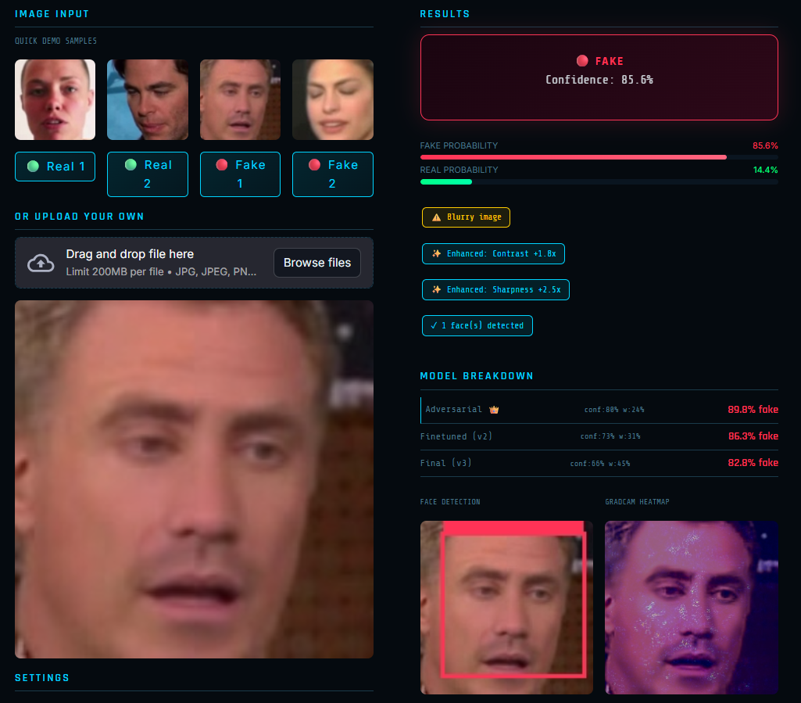

# DeepShield — Deepfake Detection Module
### Part of CyberShield | IEEE Conference 2026 | Alliance University

---

## What is DeepShield?

DeepShield is an AI-powered deepfake detection system that identifies
whether a face image or video is real or AI-generated.
It uses a fine-tuned EfficientNet-B0 with a dynamic confidence-weighted
ensemble of 3 independently trained model variants.

---

## My Contribution

- Built the complete DeepShield deepfake detection module
- Fine-tuned EfficientNet-B0 across 5 diverse benchmark datasets
- Implemented dynamic confidence-weighted ensemble of 3 model variants
- Added GradCAM explainability heatmaps
- Implemented FGSM adversarial attack testing and RIP defense
- Built and integrated the entire CyberShield unified Streamlit dashboard
- Connected all 3 teammates modules into one single platform

**Built by:** M Umme Kulsum (2023BCSE07AED240)
**Project:** CyberShield — Unified Cybersecurity Platform
**Team:** Disha K, M Umme Kulsum, Sahana M, Sakshi J Kame
**Mentor:** Dr. Rathnakar Achary

---

## Results

### Image Detection
| Dataset | Accuracy | Type |
|---|---|---|
| Midjourney | 99.90% | Diffusion fakes |
| StyleGAN | 97.30% | GAN fakes |
| Validation (Mixed) | 93.50% | Primary metric |
| CelebDF | 81.50% | Unseen — +30pp over published |
| Real-World | 48.50% | Unseen low quality |

### Video Detection
| Dataset | Accuracy | Type |
|---|---|---|
| FF++ Overall | 95.50% | Seen |
| FF++ Real | 100.0% | Seen |
| FF++ Deepfakes | 96.0% | Seen |
| FF++ Face2Face | 92.0% | Seen |
| FF++ FaceSwap | 88.0% | Seen |
| DFD Overall | 72.86% | Unseen |

### Adversarial Robustness
| Condition | Accuracy |
|---|---|
| Clean Input | 95.50% |
| Under FGSM Attack | 9.50% |
| After RIP Defense | 53.00% |
| Recovery | +74 percentage points |

### Model Comparison
| Model | Parameters | CelebDF | Size |
|---|---|---|---|
| EfficientNet-B0 (Ours) | 4.01M | 81.50% | 15.59MB |
| XceptionNet (Rossler 2019) | 22M | 51.20% | 88MB |
| Multi-Attentional (Zhao 2021) | 30M+ | 52.00% | 120MB+ |
| Vision Transformer (ViT) | 86M | ~85.00% | 327MB |

---

## Tech Stack

| Component | Tool |
|---|---|
| Language | Python 3.11 |
| Deep Learning | PyTorch 2.1.0 |
| Model Architecture | EfficientNet-B0 via Timm 0.9.16 |
| Computer Vision | OpenCV (Face Detection) |
| Image Processing | Pillow |
| Dashboard | Streamlit |
| Training Platform | Kaggle GPU (NVIDIA Tesla P100) |
| Visualization | Matplotlib (GradCAM) |

---

## How to Run

**Step 1 — Clone the repository**
git clone https://github.com/Kulsum416/DeepShield.git
cd DeepShield

**Step 2 — Install dependencies**
pip install -r requirements.txt

**Step 3 — Download model files**

Download from Google Drive and place in C:\Users\UMME\Downloads\
https://drive.google.com/drive/folders/14nJ4eqoYe0wiNFGVF9woFRqdPJRDB9Ix?usp=sharing

**Step 4 — Run the dashboard**
streamlit run main_app.py

---

## Project Structure
DeepShield/

├── main_app.py              — Unified CyberShield dashboard

├── deepfake_dashboard.py    — Deepfake detection module

├── requirements.txt         — Dependencies

├── dashboard_screenshot.png — Dashboard demo screenshot

├── models/

│   └── model_links.txt      — Google Drive links to model files

└── results/

└── results_summary.txt  — Complete accuracy results

---

## Key Features

- **Lightweight** — Only 4.01M parameters, 15.59MB model size
- **Accurate** — 81.50% on completely unseen CelebDF dataset
- **Robust** — FGSM attack tested with RIP defense (+74pp recovery)
- **Explainable** — GradCAM heatmaps show which facial region was manipulated
- **Fast** — Runs on CPU, no GPU required for inference
- **Integrated** — Part of CyberShield unified cybersecurity platform

---

## Full Project

The complete CyberShield platform (all 3 modules) is available at:
https://github.com/dishamurthy-A/CyberShield

---

## Dashboard Screenshot

